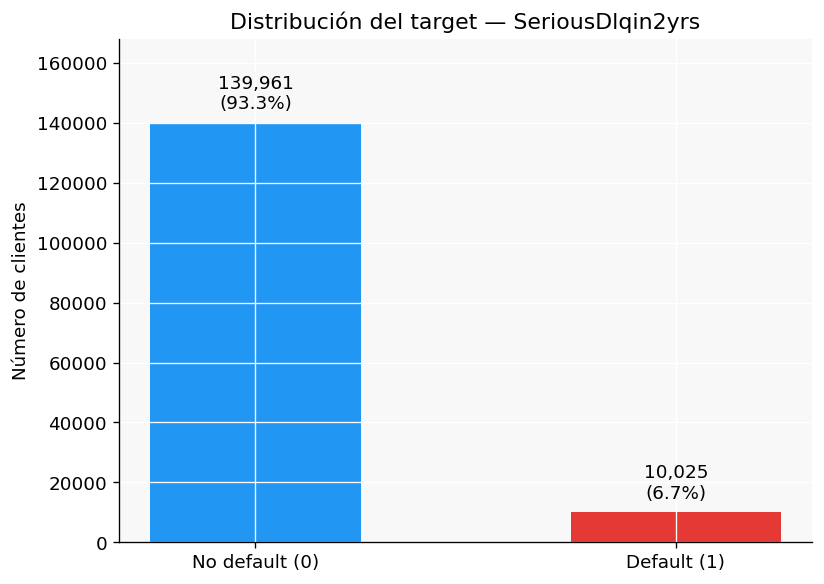
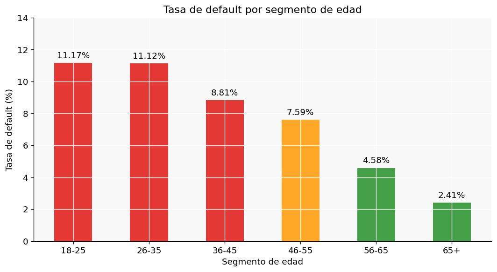
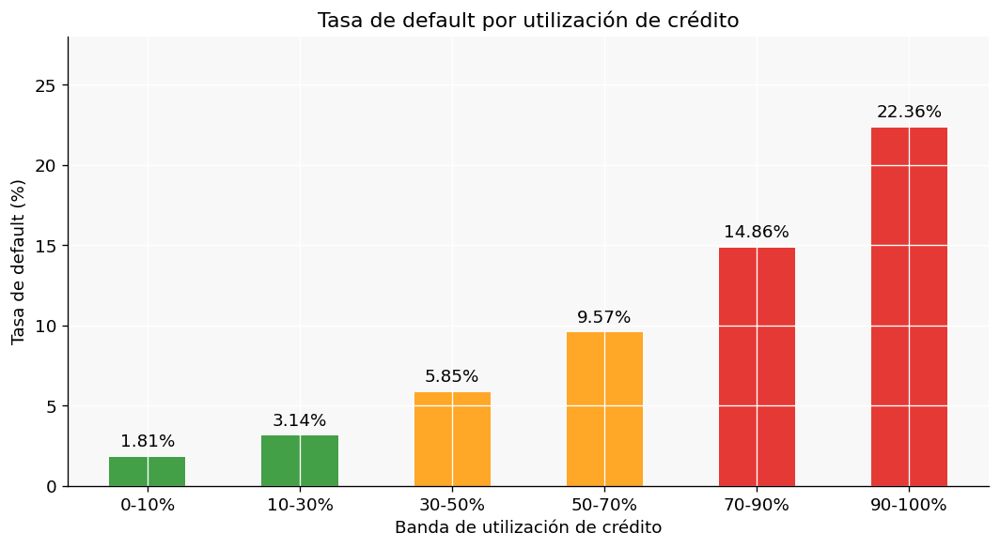
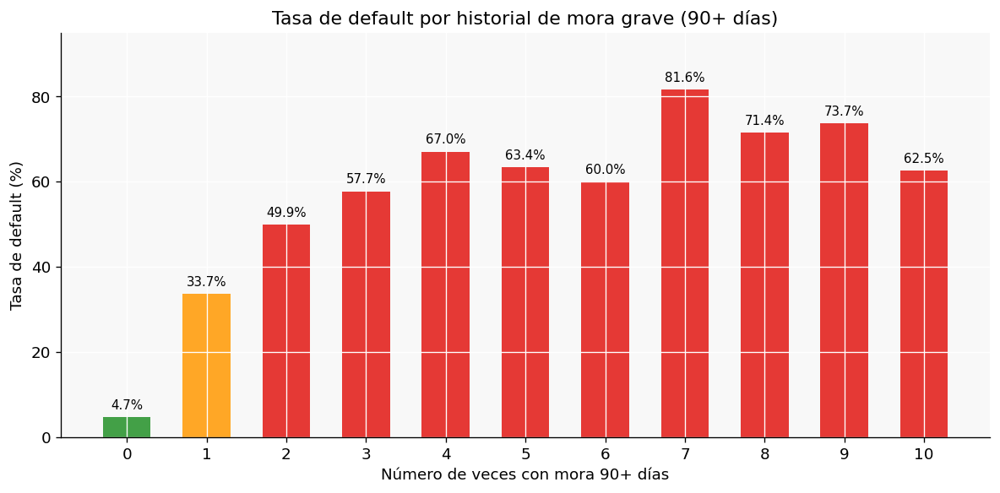
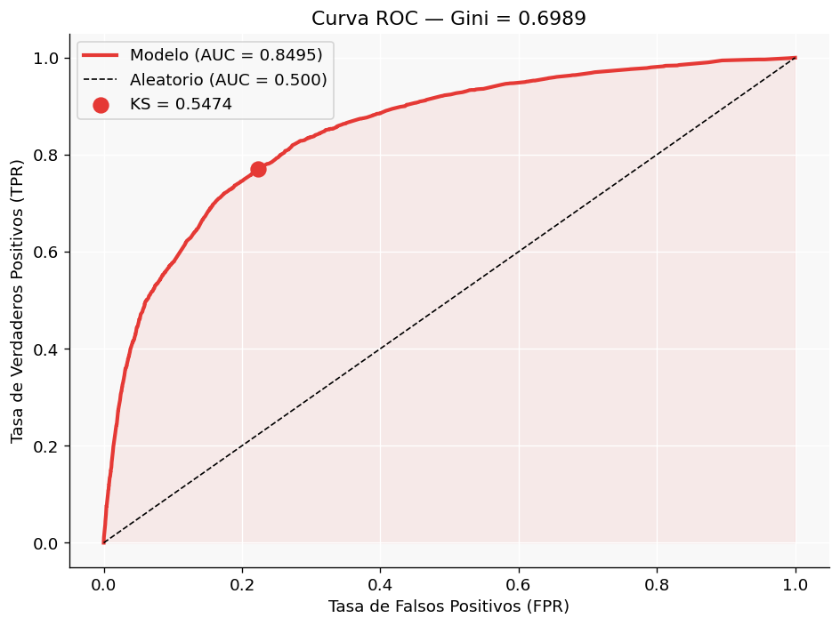
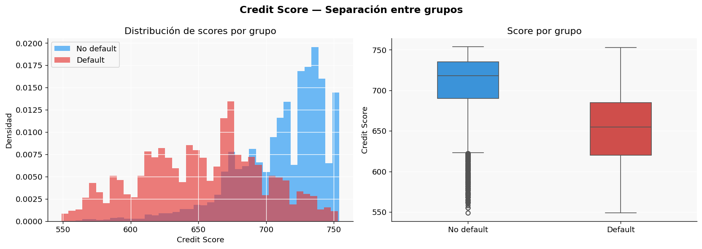

# Credit Risk Scorecard

Proyecto de análisis y modelado de riesgo crediticio construido 
con datos reales de Kaggle siguiendo estándares de la industria 
bancaria (Basel II).

## Estructura del proyecto

```
credit-risk-scorecard/
├── data/
│   ├── raw/               <- Dataset original de Kaggle (no incluido)
│   └── processed/         <- Datos limpios generados por los notebooks
├── sql/
│   └── 01_data_quality.sql  <- Queries de análisis con DuckDB
├── notebooks/
│   ├── 01_DA_EDA.ipynb      <- Parte 1: Análisis exploratorio
│   └── 02_DS_Scorecard.ipynb <- Parte 2: Modelo y scorecard
├── dashboard/
│   └── credit_risk_dashboard.pbix <- Dashboard Power BI
├── models/
│   └── scorecard_model.pkl  <- Modelo entrenado
├── reports/
│   └── figures/             <- Gráficos generados
└── README.md
```

## Dataset

**Give Me Some Credit** · [Kaggle](https://www.kaggle.com/c/GiveMeSomeCredit)

| Campo | Valor |
|---|---|
| Registros | 150,000 clientes |
| Variables | 11 (10 predictoras + 1 target) |
| Target | Mora grave (90+ días) en los próximos 2 años |
| Tasa de incumplimiento | 6.68% |

### Variables principales

| Variable | Descripción |
|---|---|
| `SeriousDlqin2yrs` | Target — mora grave en 2 años |
| `RevolvingUtilizationOfUnsecuredLines` | % de crédito rotativo utilizado |
| `age` | Edad del cliente |
| `NumberOfTimes90DaysLate` | Veces con mora 90+ días |
| `MonthlyIncome` | Ingreso mensual |
| `DebtRatio` | Ratio deuda / ingresos |

## Instalación

```bash
# Clonar el repositorio
git clone https://github.com/tu-usuario/credit-risk-scorecard.git
cd credit-risk-scorecard

# Crear entorno virtual
python -m venv .venv

# Activar entorno virtual
.venv\Scripts\activate        # Windows
source .venv/bin/activate     # Mac/Linux

# Instalar dependencias
pip install -r requirements.txt
```

> **Nota:** El dataset no está incluido en el repositorio.
> Descarga `cs-training.csv` de Kaggle y colócalo en `data/raw/`.

## Resultados

### Análisis exploratorio (Parte 1)

| Hallazgo | Valor |
|---|---|
| Tasa de default global | 6.68% |
| Segmento más arriesgado | 18-35 años (11% default) |
| Segmento más seguro | 65+ años (2.41% default) |
| Clientes con uso crédito > 90% | 22.36% de default |
| Con 1 mora 90d previa | 33.66% de default |
| Con 2 moras 90d previas | 49.90% de default |

### Modelo (Parte 2)

| Métrica | Valor | Benchmark industria |
|---|---|---|
| AUC-ROC | 0.8495 | > 0.70 |
| Gini | 0.6989 | > 0.35 |
| KS Statistic | 0.5474 | > 0.30 |

### Scorecard — Segmentación de cartera

| Rango | % Cartera | Tasa default |
|---|---|---|
| Muy bajo (750+) | 6.9% | 0.4% |
| Bajo (700-750) | 58.3% | 1.7% |
| Moderado (650-700) | 26.7% | 9.5% |
| Alto (600-650) | 6.1% | 35.0% |
| Crítico (<600) | 1.9% | 51.2% |

## Visualizaciones

### Distribución del target


### Tasa de default por segmento de edad


### Tasa de default por utilización de crédito


### Tasa de default por historial de mora


### Curva ROC del modelo


### Distribución de credit scores


## Stack tecnológico

| Herramienta | Uso |
|---|---|
| Python 3.10 | Lenguaje principal |
| Pandas / NumPy | Manipulación de datos |
| Matplotlib / Seaborn | Visualización |
| DuckDB | SQL analítico en local |
| Scikit-learn | Modelo de regresión logística |
| Scorecardpy | WoE, IV y scorecard |
| Power BI | Dashboard ejecutivo |
| Joblib | Serialización del modelo |

## Stack del proyecto

- **Parte 1 — Data Analyst:** Python · DuckDB · Power BI
- **Parte 2 — Data Scientist:** Python · Scikit-learn · Scorecardpy